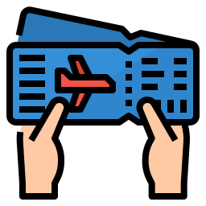

# Airline Ticket Reservation
## Intro

---
!!! warning "Desarrollo Local"
    **NO USE repl.it** para el desarrollo del proyecto, debe de instalar un compilador de C en su computadora, con repl es imposible trackear su avance en un sistema de control de versiones o [conecte su cuenta de repl con github](https://dev.to/twalton83/you-can-now-run-repos-on-repl-it-9dc) si no puede o no pudo conectar su cuenta de repl **NO USE repl.it**


---




!!! note "Clear Screen"
    en todo tiempo es mejor si hace un [clear screen](appendix/#clearscreen)


Usted simulara un sistema de reservas de ==asiento de vuelo== desde la perspectiva de la Aerolinea (operador), no desde el usuario.

Cuando uno reserva en linea un vuelo hay una seccion en la que uno puede elegir el asiento de su vuelo, para este proyecto es esta fase de la reserva que usted debe implementar.

Los asientos de un vuelo se representan con una Letra del abecedario (ABC DEF, 6 caracteres, Numero de columnas) + un digito (1-32, numero de filas), ejemplos:

- **1A:** fila 1 columna 1
- **22C:** fila 22 columna 3
- **32F:** fila 32 columna 6

!!! note ""
    los asientos dentro del vuelo sera una matriz (un arreglo de arreglos, es decir una tabla) de tamaño 6x32.


<style type="text/css">
.tg  {border-collapse:collapse;border-spacing:0;}
.tg td{font-family:Arial, sans-serif;font-size:14px;padding:10px 5px;border-style:solid;border-width:1px;overflow:hidden;word-break:normal;border-color:black;}
.tg th{font-family:Arial, sans-serif;font-size:14px;font-weight:normal;padding:10px 5px;border-style:solid;border-width:1px;overflow:hidden;word-break:normal;border-color:black;}
.tg .tg-k04z{background-color:#c0c0c0;border-color:#656565;text-align:left;vertical-align:top}
.tg .tg-c3ow{border-color:inherit;text-align:center;vertical-align:top}
.tg .tg-mtln{background-color:#c0c0c0;border-color:#656565;text-align:center;vertical-align:top}
.tg .tg-y6fn{background-color:#c0c0c0;text-align:left;vertical-align:top}
.tg .tg-0lax{text-align:left;vertical-align:top}
</style>
<table class="tg">
  <tr>
    <th class="tg-k04z"></th>
    <th class="tg-mtln">A</th>
    <th class="tg-mtln">B</th>
    <th class="tg-mtln">C</th>
    <th class="tg-mtln">D</th>
    <th class="tg-mtln">E</th>
    <th class="tg-mtln">F</th>
  </tr>
  <tr>
    <td class="tg-y6fn">1</td>
    <td class="tg-c3ow">A1</td>
    <td class="tg-c3ow">B1</td>
    <td class="tg-c3ow">C1</td>
    <td class="tg-c3ow">D1</td>
    <td class="tg-c3ow">E1</td>
    <td class="tg-c3ow">F1</td>
  </tr>
  <tr>
    <td class="tg-y6fn">2</td>
    <td class="tg-c3ow">A2</td>
    <td class="tg-c3ow">B2</td>
    <td class="tg-c3ow">C2</td>
    <td class="tg-c3ow">D2</td>
    <td class="tg-c3ow">E2</td>
    <td class="tg-c3ow">F2</td>
  </tr>
  <tr>
    <td class="tg-y6fn">3</td>
    <td class="tg-c3ow">A3</td>
    <td class="tg-c3ow">B3</td>
    <td class="tg-c3ow">C3</td>
    <td class="tg-c3ow">D3</td>
    <td class="tg-c3ow">D3</td>
    <td class="tg-c3ow">F3</td>
  </tr>
  <tr>
    <td class="tg-y6fn">4</td>
    <td class="tg-0lax">A4</td>
    <td class="tg-0lax">B4</td>
    <td class="tg-0lax">C4</td>
    <td class="tg-0lax">D4</td>
    <td class="tg-0lax">E4</td>
    <td class="tg-0lax">F4</td>
  </tr>
  <tr>
    <td class="tg-y6fn">5</td>
    <td class="tg-0lax">A5</td>
    <td class="tg-0lax">B5</td>
    <td class="tg-0lax">C5</td>
    <td class="tg-0lax">D5</td>
    <td class="tg-0lax">E5</td>
    <td class="tg-0lax">F5</td>
  </tr>
  <tr>
    <td class="tg-y6fn">6</td>
    <td class="tg-0lax">A6</td>
    <td class="tg-0lax">B6</td>
    <td class="tg-0lax">C6</td>
    <td class="tg-0lax">D6</td>
    <td class="tg-0lax">E6</td>
    <td class="tg-0lax">F6</td>
  </tr>
</table>

<details>
    <summary>Image, click to expand</summary>


</details>


<br><br>

---

## Fase 1 - Menu

Para esta fase debe desarrollar un menu de bienvenida

- La matriz se inicializara todas las casillas en `'0'`, ningun asiento reservado.
- Mostrara un ==menu== con opciones para empezar a reservar.
- Pedira el numero de vuelo que la aerolinea estar trabajando, el formato del vuelo sera un texto de 5 caracteres,ejemplos: "AA101", "UA345", "BTZ11", no debe verificar nada de este ID excepto su longitud, este ID servira para mostrarlo en la terminal.
- Las opciones seran:
      1. Reservar asiento
      - Ver disponibilidad de Asientos.
      - Salir
- Este menu se ejecutara infinitamente, al menos que se seleccione la opcion "Salir"

??? info "Menu"

    [Ejemplo](ejemplo.md#menu-bienvenida)


---

## Fase 2 - reservacion

Si en el menu se elige la opcion "Reservar asiento" entrara a esta etapa.

1. En esta fase se implementara la reserva de un asiento.
- Se le pedira al operador que ingrese un numero de asiento en el format `"LetraDigito"`
- Su programa debera "interpretar" este formato a un formato de matriz[Letra][Digito], debera hacer alguna funcion que recibiendo una Letra devuelva el numero de columna que representa en la matriz de reservaciones.
- Una vez se interpreta eso, su programa debe verficiar si este asiento ya fue reservado, de ser asi se le mostrara al operador que el asiento esta reservado y que debe volver a elegir otro asiento (Volver a paso 2)
- Si el asiento se encuentra libre debe "reservar" este asiento en su matriz de alguna manera, explicada en la nota "reservas"
- Si el operador ingresa la palabra "menu" en el paso 2 entonces el programa debe salir de la "reserva" y regresara al menu principal.


!!! info "reservas"

    **Letra**: columnas

    **Digito**: Filas

    **Dentro de su matriz**:

    - Asientos reservados se representaran con `'X'`{>>MAYUS<<}.
    - Y asiento libre lo representara con `'0'`

    [Ejemplo](ejemplo.md#reservar-asiento)

---
## Fase 3 - Ver disponibilidad

Si en el menu se elige la opcion "Ver disponibilidad de Asientos" entrara a esta parte.

1. En esta fase se implementara la visualizacion de reservas
2. Se mostara la matriz de una forma "grafica" en la terminal, con sus encabezados en columnas (A-F) y las filas (1-32)
3. Mostrando los asientos reservados `'X'` y los asientos libres  `'0'`


!!! info "Ejemplo"
    [Ejemplo](ejemplo.md#ver-disponibilidad-de-asientos)

## Fase 4 -  Ver Resumen

En esta fase debe mostrar un resumen de reservas.

- Mostrar cuantos asientos han sido reservados y cuantos quedan libres.
- Mostrar un porcentaje de reservados y libres.

!!! note ""
    Para esta fase debe [**iterar**]() sobre toda la matriz buscando asientos reservados y libres.


!!! info "Ejemplo"
    [Ejemplo](ejemplo.md#ver-resumen)

---

## Puntos Extra
Si quiere obtener puntos extra sera posible de la siguiente manera,

- Agregara una nueva funcionalidad `Sugerir Asiento`
- Cuando un vuelo se encuentra casi lleno sera muy dificil encontrar un asiento libre, que le parece si su programa le sugiere el asiento?
- Esta sugerencia debera suceder cuando en la fase de [reservacion](#fase-2---reservacion) nos encontremos en el punto **#4** {>>mostrara al operador que el asiento esta reservado y que debe volver a elegir otro asiento (Volver a paso 2)<<}
- Para poder sugerir un asiento que no este ocupado su programa debe 'recorrer' por toda la matriz de asientos hasta encontrar el primer asiento disponible y ese es el que va a sugerir.

!!! info cambio en Menu
    ```
    Asiento 'A6' ya reservado, ingrese un nuevo asiento

    Sugerido: 'F4'
    ```

---


<br>


??? info "Ya leyo todo?"
    si leyo toda esta pagina haga click [aqui](ejemplo.md)